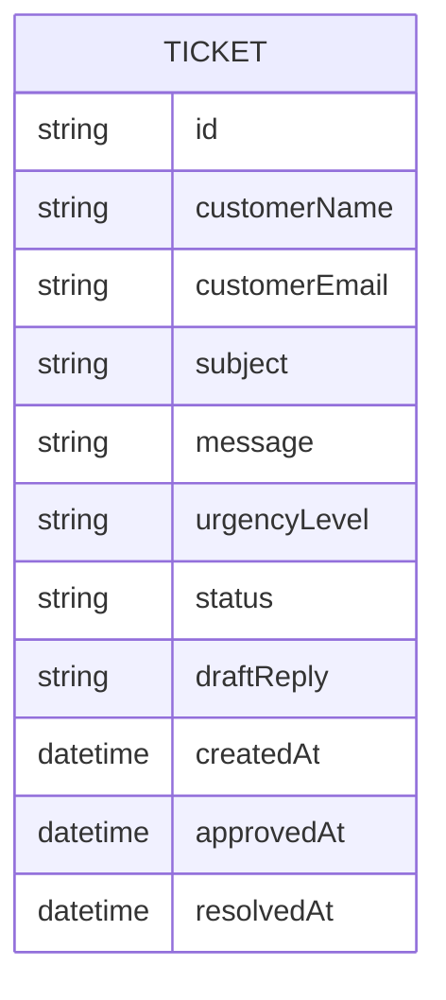

# Domain Model

A single entity carries the whole lifecycle of a ticket, from a customer's submission through AI triage to an agent's approved, sent reply.

- `urgencyLevel` is one of `low`, `medium`, `high`, `urgent`, set automatically on submission.
- `status` moves `new` → `draft-ready` → `approved` → `resolved` as the AI drafts a reply and a Support Agent edits, approves, and (after sending it themselves) resolves it.
- `draftReply` is generated automatically on submission and may be edited by a Support Agent before approval.

