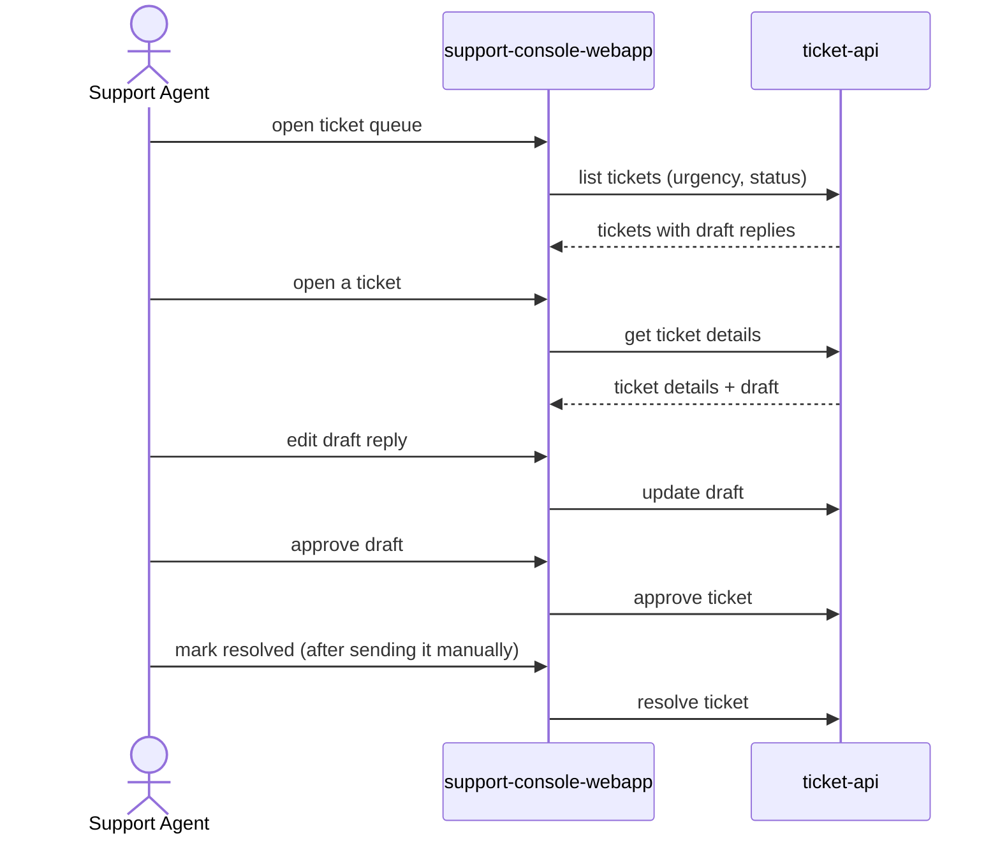

# Agent review and resolution

A Support Agent works the prioritized queue: reviewing a ticket's AI draft, editing and approving it, then marking it resolved after sending the reply themselves.

```mermaid
sequenceDiagram
    actor SupportAgent as Support Agent
    participant support-console-webapp
    participant ticket-api

    SupportAgent->>support-console-webapp: open ticket queue
    support-console-webapp->>ticket-api: list tickets (urgency, status)
    ticket-api-->>support-console-webapp: tickets with draft replies
    SupportAgent->>support-console-webapp: open a ticket
    support-console-webapp->>ticket-api: get ticket details
    ticket-api-->>support-console-webapp: ticket details + draft
    SupportAgent->>support-console-webapp: edit draft reply
    support-console-webapp->>ticket-api: update draft
    SupportAgent->>support-console-webapp: approve draft
    support-console-webapp->>ticket-api: approve ticket
    SupportAgent->>support-console-webapp: mark resolved (after sending it manually)
    support-console-webapp->>ticket-api: resolve ticket
```

