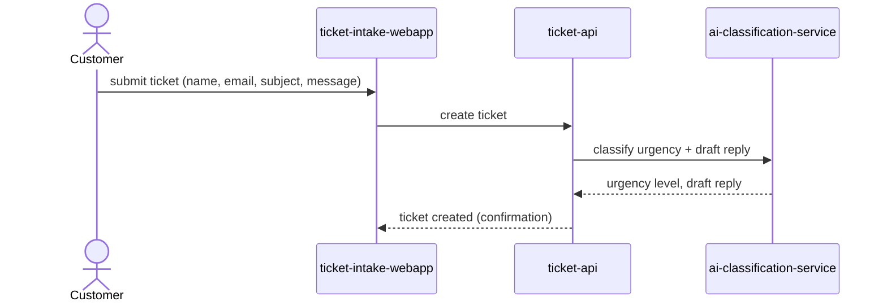

# Ticket submission and triage

A Customer submits a ticket through the public form, and it is classified and drafted automatically before any Support Agent sees it.

```mermaid
sequenceDiagram
    actor Customer
    participant ticket-intake-webapp
    participant ticket-api
    participant ai-classification-service

    Customer->>ticket-intake-webapp: submit ticket (name, email, subject, message)
    ticket-intake-webapp->>ticket-api: create ticket
    ticket-api->>ai-classification-service: classify urgency + draft reply
    ai-classification-service-->>ticket-api: urgency level, draft reply
    ticket-api-->>ticket-intake-webapp: ticket created (confirmation)
```

